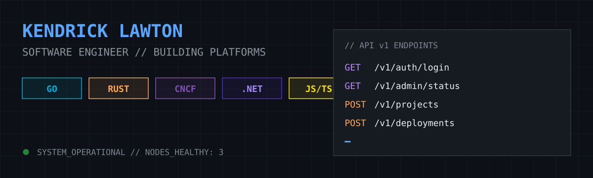

### **Architecting the Invisible Systems That Power Progress**

I am a **Software Engineer** driven by a deep fascination with Internal Developer Platforms (IDPs). I believe that the most powerful infrastructure is the kind that remains invisible—a seamless foundation that empowers developers to focus entirely on building rather than plumbing.

> *"Infrastructure should be invisible, security should be intrinsic, and high-concurrency is a challenge to be mastered, not a source of anxiety."*

---

### 🧪 The Vision: [Project Platform]()

Project Platform is my long-term mission to architect a **Go-centric Internal Developer Platform**. It is an opinionated ecosystem designed to strip away the "infrastructure tax," allowing Go developers to deploy with the radical efficiency of a modern IDP.

* **Go-First Control Plane:** Building a high-performance backend using **Go** and the **chi** router to handle complex, versioned service routing.
* **Native Orchestration:** Deeply integrating with **Kubernetes** to manage node health, automated deployments, and cluster state from a centralized control plane.
* **Intrinsic Security:** Standardizing enterprise-grade identity through **WorkOS** and enforcing kernel-level security policies.

---
